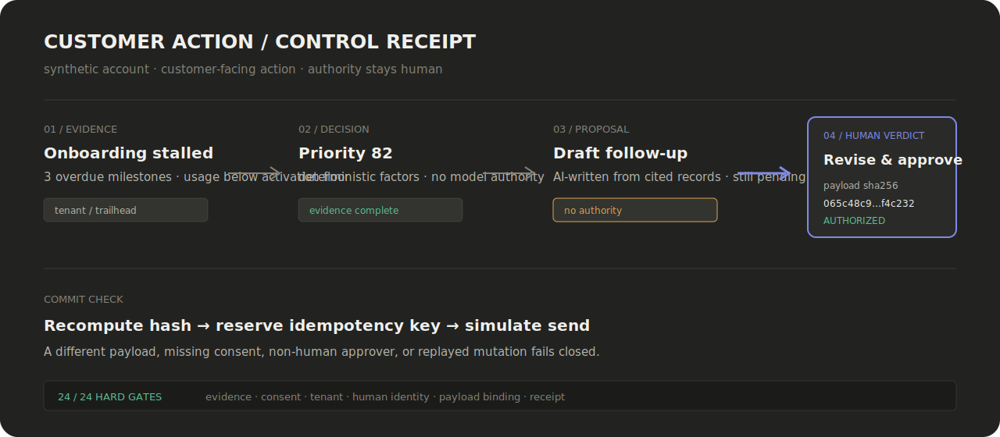

# Customer Action Control Plane

Customer teams already have enough dashboards. The harder problem is turning scattered
CRM, onboarding, product, support, and communication evidence into the right action—then
keeping an AI draft from becoming an unauthorized customer commitment.

This system assembles account evidence, computes priority with deterministic rules,
drafts the next action, and stops at a human decision boundary. An approval authorizes
one exact payload hash. Revise the message and the authorized hash changes; tamper with
it afterward and the committer refuses. The agent can propose. It cannot approve itself
or mint permission through model text.

**The receipt that matters:** the current scorecard passes **24/24 hard gates** covering
evidence, consent, tenant isolation, human identity, payload binding, unsafe drafts, and
the real proposal-to-commit path.

**[Open the live read-only demo](https://ultra-csm.vercel.app/)** — synthetic data,
no login, and customer sends disabled.



## Run the read-only demo in 90 seconds

The [hosted demo](https://ultra-csm.vercel.app/) is a no-login, read-only operations
workspace backed by synthetic data. You can also run the same build locally.
Open the queue, select **Trailhead Logistics**, and follow four stages shown in the UI:

1. evidence assembled from tenant-scoped source records;
2. priority computed without a model;
3. an AI-written draft proposed with cited evidence;
4. a human decision required before release.

The read-only build deliberately disables decisions and sends. The same UI against the
local governed API records approve, deny, and revise verdicts; an approved verdict is
not labeled as sent or committed without a separate committer receipt.

The dedicated `/ui/action-control/` route makes that boundary inspectable. In a local
build it can approve an exact synthetic payload, commit it to a temporary outbox, prove
an idempotent retry, and demonstrate tamper refusal. The hosted static build does **not**
fabricate those interactions: until a separate sandbox-only API is deployed, it shows
the frozen executable proof and names the backend as unavailable. See
[`docs/ACTION_CONTROL_SANDBOX.md`](docs/ACTION_CONTROL_SANDBOX.md).

```bash
make setup
make hosted-readonly-demo
ULTRA_CSM_DEMO_NOAUTH=1 ULTRA_CSM_BIND_HOST=127.0.0.1 PYTHONPATH=src:. \
  .venv/bin/python -m uvicorn ultra_csm.api:app --host 127.0.0.1 --port 8000
```

Open `http://127.0.0.1:8000/ui/`. See [the walkthrough](docs/DEMO.md) for the
reviewer script and exact boundaries.

`make hosted-readonly-demo` verifies the committed fixtures and static build without
rewriting source files. Maintainers can intentionally refresh fixtures with
`make hosted-readonly-demo-generate`.

## The control path

```text
tenant-scoped evidence
  → deterministic value model and priority
  → grounded AI draft
  → pending action proposal
  → human approve / revise / deny
  → payload-bound committer
  → decision receipt
```

The system uses one shared customer value model rather than independent agents that can
disagree about account truth. Time-to-value, retention, and expansion are lenses over
that model. Product and Engineering handoffs share the evidence spine but do not bypass
the customer-action gate.

## Start reading here

The representative vertical slice is documented in [docs/READING_PATH.md](docs/READING_PATH.md):

- `src/ultra_csm/agent1/sweep.py` — evidence becomes deterministic priority and a proposed action;
- `src/ultra_csm/governance/gate.py` — the human verdict and payload-binding state machine;
- `src/ultra_csm/committers.py` — fail-closed simulated writes and idempotent receipts;
- `tests/test_action_gate_machine.py` — approve, deny, revise, self-approval, consent, and tamper attacks.

The first file is still too large. That is named debt, not hidden craft; the reading-path
note identifies the extraction seam and why it has not been disguised with a showcase
wrapper.

## Verify the claim

```bash
make scorecard-csm-check   # 24/24 deterministic hard gates
make eval                  # offline suite + gold/knowability checks
make lint hygiene
make security-scan         # full public history, narrow fixture allowlist
make hosted-readonly-demo # fixture drift check, UI lint, static build
make hosted-action-control-deploy-check # isolated backend bundle + sandbox contracts
```

No cloud credentials or customer data are needed for these gates. Credentialed connector
and model lanes are intentionally separate from offline verification.

## Claim boundary

- The reviewer demo is synthetic and read-only. It proves the operations surface and the
  decision boundary, not production customer outcomes.
- Salesforce, Rocketlane, and Gmail paths were exercised only against dev, trial, or
  burner scopes. This is not a production deployment claim.
- The quality judge is not fully validated: five dimensions are scoped-gateable, one is
  excluded, and the gold set has one human labeler.
- Realized-outcome evidence currently covers a synthetic terminal-renewal slice. The
  system does not infer customer value from usage alone.

The detailed receipts live in [docs/LIMITS.md](docs/LIMITS.md).

Apache-2.0 — see [LICENSE](LICENSE).

## Repository surface

This summary is generated from statically detected package, CLI, API, schema, and test surfaces. Run `clean-docs inventory` for the full catalog.

<!-- clean-docs:begin repository-surface -->
| surface | discovered | examples |
| --- | ---: | --- |
| api-symbol | 1554 | `APIMetrics`, `ARRChange`, `AccountAttributionCandidate`, and 1551 more |
| cli-command | 19 | `alarms`, `approve`, `check-in`, and 16 more |
| cli-option | 261 | `--a6-expansion`, `--account`, `--account-slug`, and 258 more |
| mcp-tool | 18 | `confirm_book`, `confirm_book_mappings`, `get_account_brief`, and 15 more |
| package | 1 | `ultra-csm` |
| schema | 3 | `ActionControlSandboxSession`, `ActionControlVerticalSlice`, `vercel` |
| test-suite | 143 | `tests/test_account_brief_comms.py`, `tests/test_action_control_contract.py`, `tests/test_action_control_sandbox.py`, and 140 more |

<!-- clean-docs:inventory-sha256 b83409383ff2249939c6175211986ff35ac6390c1063fd322f63653d46486873 -->
<!-- clean-docs:end repository-surface -->
