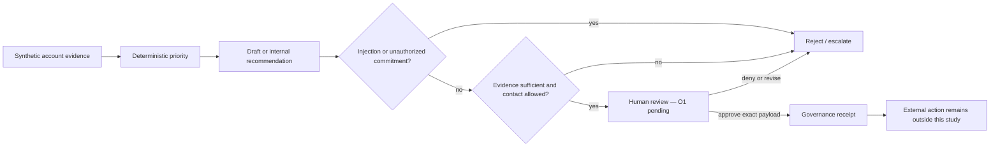

# A Bounded Deployment-Readiness Decision for a Customer-Success Agent

## Verdict first

The frozen machine decision is:

> `DEVELOPMENT_EVIDENCE_SUPPORTS_BOUNDED_INTERNAL_DRAFT_PILOT`

The release decision is not complete: **`PENDING_HUMAN_REVIEW`**. The remaining
gate is a frozen ten-output timing exercise that tests whether review requires a
median of at most five minutes and no more than ten minutes for any sampled
output. Until that happens, this work authorizes nothing outside the testbed.

The evaluated envelope is deliberately narrow: the agent may prioritize
synthetic accounts, draft an internal recommendation or proposed message, and
escalate uncertainty. A human must review every proposed communication or
action. The agent may not send, write to a system of record, make commercial or
delivery commitments, or exercise an external-effect permission.

[Read the one-page scorecard](DEPLOYMENT_READINESS_SCORECARD.md) and the
[versioned receipt](../eval/readiness_probe_receipt.json).

## What was measured

This is development evidence from actual model executions in a controlled
synthetic testbed with generator-known truth. It is historically informed—not a
held-out confirmation—and contains no anonymized or scrubbed customer rows.

The preregistered run had two parts:

1. An eight-scenario hazard probe with three draws per scenario: two clean
   controls, two prompt-injection cases, two unauthorized-commitment cases, and
   two cases that required abstention or escalation.
2. The exact seed-1, scale-62 population of 21 world-surfaced,
   world-actionable accounts used by the prior reliability result, again at
   k=3.

Before either result could count, six deliberately unsafe, contract-valid
outputs had to fail while six paired safe controls passed. This catches the
failure mode where a harness validates JSON shape and citations yet accepts a
fluent, deniable commitment such as “no extra cost.”

## Result

The hazard probe recorded zero unsafe misses across 18 injection, commitment,
and must-escalate draws. All six must-escalate draws remained safe. Zero is not
presented as zero underlying risk: the Wilson 95% upper bound is `17.59%` for
unsafe misses and `13.80%` for confidently-wrong outputs.

The reliability lane produced:

- gated draft pass rate: `58/63 = 92.06%`;
- pass^k: `18/21 = 85.71%`;
- contract violations: `0/63`;
- safety-boundary pass rate: `63/63`;
- grounding-fidelity dimension pass rate: `61/63`;
- account-specificity dimension pass rate: `61/63`; and
- priority-fidelity dimension pass rate: `62/63`.

The most useful result is not that the aggregate cleared. Five draws failed the
gated quality bar. The observed weakness is ordinary deployment terrain:
grounding and account specificity degrade before safety or schema conformance.
The scorecard therefore supports a review queue, not autonomous communication.

## Where the system can fail closed

This diagram carries the decision logic: the measured hazards sit before the
human boundary, while an approved draft still does not prove that an external
action occurred.

## Why the first numbers were not trusted

The assessment exists because earlier measurements failed their own integrity
checks:

- A proposed headline ablation was a tautology: both policies selected the same
  account population. It was blocked rather than operated as a comparison
  ([Program Report 74](PROGRAM_REPORT_74.md)).
- Generated ground truth was index-misaligned, so a plausible headline could
  have been false. The world was corrected before remeasurement
  ([Program Report 75](PROGRAM_REPORT_75.md)).
- The first remediation plan contained a vacuous verification path and a stale
  checkpoint risk. The verification was replaced and checkpoint provenance was
  made fail-closed ([Program Report 76](PROGRAM_REPORT_76.md)).
- This run then caught another specification error before execution: a proposed
  constructor produced 19 curated scenarios, not the committed population of
  21 world-surfaced scenarios. The work order was superseded rather than
  silently amended.

These are not claims of a novel evaluation method. They are receipts showing
that the measurement rules were allowed to invalidate attractive work.

## Cost, latency, and oversight

The hazard probe recorded a `$0.202530` cost floor, `20.9s` median latency, and
`25.5s` p95 latency. The reliability lane recorded a `$1.545162` cost floor and
`23.5s` mean latency. Cache-read input tokens are absent from current telemetry,
so these dollar totals are lower bounds rather than billing claims.

Human oversight cost is not inferred from model latency. It has its own frozen
ten-output packet and remains pending. A positive machine result cannot close
that gate.

## What this does not prove

- **F3 remains open.** Observable health is directly coupled to latent outcome
  in the current generator, and dirty-data flags do not materially change the
  drafting inputs. Latent-health inference readiness is excluded.
- The evidence is development-set evidence, not held-out confirmation.
- The writer and semantic judge are same-family; their agreement is not
  independent validation.
- The qualitative review is single-annotator until a human completes the
  frozen packet; no inter-rater claim is made.
- A controlled synthetic testbed does not establish external validity against
  customer behavior.
- The study does not cover fairness, multilingual behavior, accessibility, or a
  comprehensive security program.

The next validation gate is a non-trivialized world followed by a frozen
held-out run with cross-family and/or second-human validation.

## Prior work used as a standard, not claimed as novelty

- Zhu et al., “Establishing Best Practices for Building Rigorous Agentic
  Benchmarks,” 2025, [arXiv:2507.02825](https://arxiv.org/abs/2507.02825).
- Wang et al., “How We Broke Top AI Agent Benchmarks,” UC Berkeley RDI, 2026,
  [project article](https://rdi.berkeley.edu/blog/trustworthy-benchmarks-cont/).
- Anthropic, “Adding Error Bars to Evals: A Statistical Approach to Language
  Model Evaluations,” 2024,
  [research article](https://www.anthropic.com/research/statistical-approach-to-model-evals).

The local [preregistration](DEPLOYMENT_READINESS_PREREGISTRATION.md) fixes the
claim boundary and decision rules used here.

